<p align="center">
  <a href="https://instantgradient.com/app">
    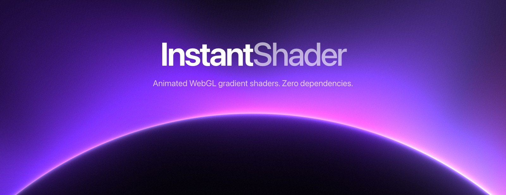
  </a>
</p>

<p align="center">
  <a href="https://www.npmjs.com/package/instantshader"></a>
  <a href="https://www.npmjs.com/package/@instantshader/react"></a>
  <a href="https://bundlephobia.com/package/instantshader"></a>
  
  
  <a href="https://github.com/ugolbck/instantshader/actions/workflows/ci.yml"></a>
  <a href="LICENSE"></a>
</p>

<p align="center">
  Drop-in animated gradient backgrounds, rendered on the GPU.<br />
  Give a shader 2 to 8 colours, mount it in any element, done.
</p>

<p align="center">
  <a href="#quick-start">Quick start</a> ·
  <a href="#shaders">Shaders</a> ·
  <a href="#api">API</a> ·
  <a href="#seamless-loops">Loops</a> ·
  <a href="#exporting-frames">Export</a> ·
  <a href="https://instantgradient.com/app">Live editor</a>
</p>

<br />

- **Seven looks**, each tunable through a handful of plain numeric params.
- **Any palette.** Pass 2 to 8 hex colours. They are blended in OKLCh, so a ramp between two saturated colours stays saturated instead of going grey in the middle.
- **Zero dependencies**, raw WebGL1, tree-shakeable: you only ship the shaders you import.
- **Seamless loops** on request, exact to the pixel, for video export.
- **Resolution independent.** The same settings give the same composition in a 300px card and a 4K export.
- Vanilla JS and React. TypeScript types included.

## Quick start

### React

```bash
npm install @instantshader/react
```

```tsx
import { Halo } from "@instantshader/react";

export function Hero() {
  return (
    <Halo
      colors={["#1b0b3a", "#8b5cf6", "#ec4899", "#fde68a"]}
      style={{ position: "absolute", inset: 0 }}
    />
  );
}
```

The component renders a `<div>` and fills it with the canvas, so **give it a size** (through `style`, `className`, or a sized parent). It is marked `"use client"`, so it works as-is inside Next.js server components.

### Vanilla JS

```bash
npm install instantshader
```

```ts
import { mountGradient, halo } from "instantshader";

const handle = mountGradient(document.getElementById("hero")!, {
  shader: halo,
  colors: ["#1b0b3a", "#8b5cf6", "#ec4899", "#fde68a"],
});

// later
handle.dispose();
```

The canvas tracks the container's size by itself and renders at the device pixel ratio, capped at 2x.

## Shaders

<table>
  <tr>
    <td width="25%">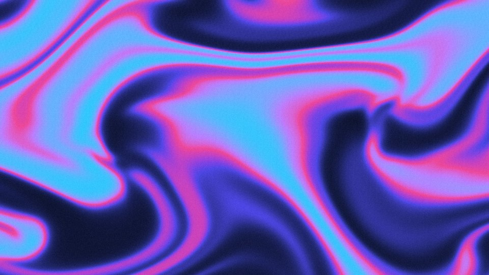<br /><b>Flow</b> <code>flow</code><br />Swirling fluid currents that fill the frame.</td>
    <td width="25%">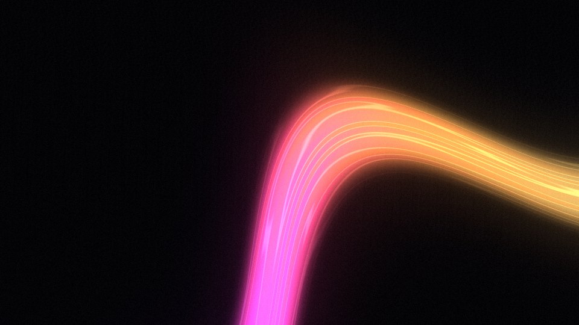<br /><b>Beam</b> <code>beam</code><br />One soft streak of light crossing a dark frame.</td>
    <td width="25%">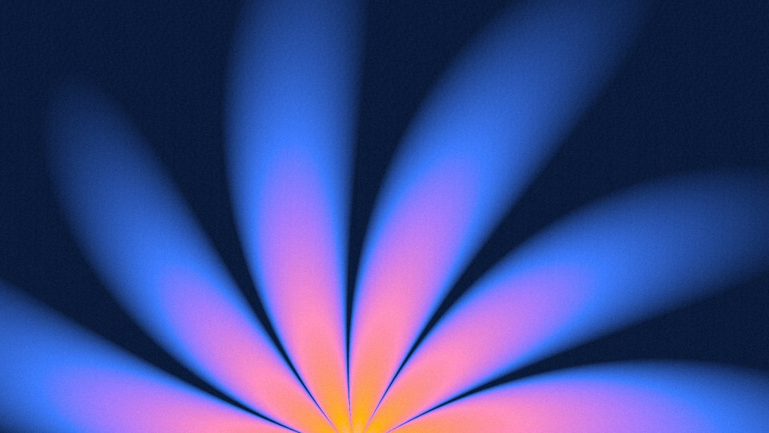<br /><b>Bloom</b> <code>bloom</code><br />A fan of huge soft petals rising from the bottom edge.</td>
    <td width="25%">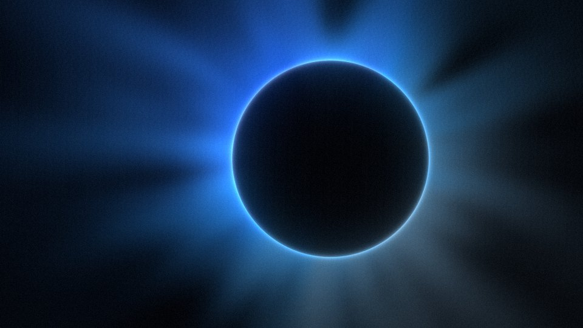<br /><b>Halo</b> <code>halo</code><br />An eclipse. Push it off-frame for a glowing horizon.</td>
  </tr>
  <tr>
    <td>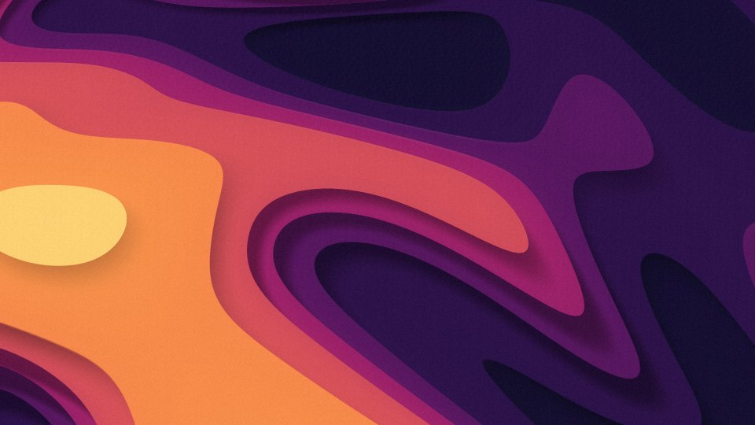<br /><b>Strata</b> <code>strata</code><br />Stacked cut-paper layers with soft shadows.</td>
    <td>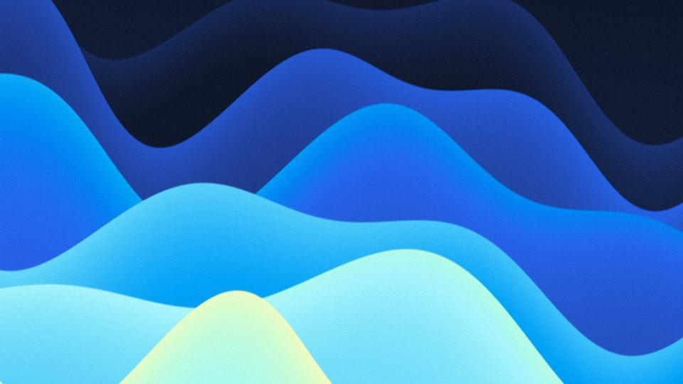<br /><b>Dune</b> <code>dune</code><br />Overlapping crests, crisp on top, airbrushed below.</td>
    <td>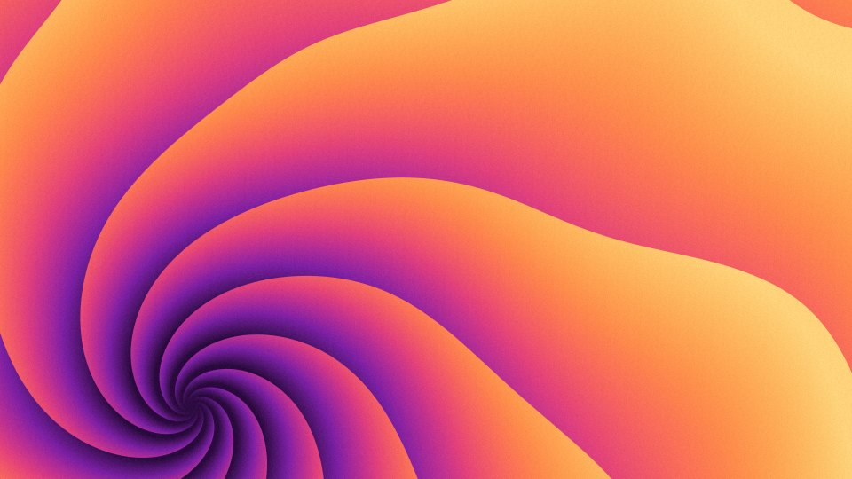<br /><b>Whorl</b> <code>whorl</code><br />A spiral of curved blades you can place anywhere.</td>
    <td>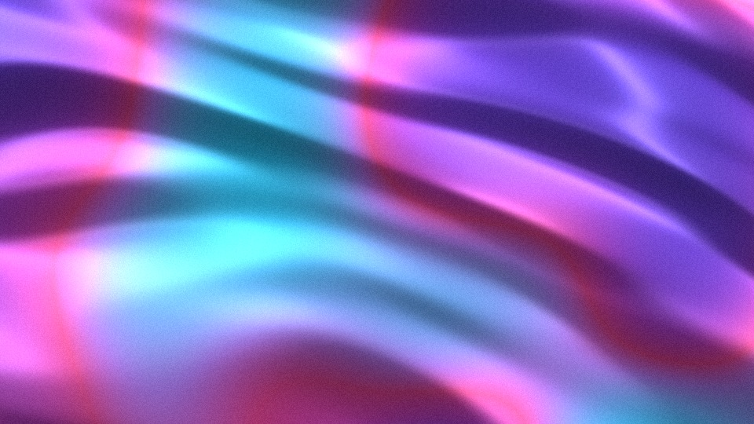<br /><b>Silk</b> <code>silk</code><br />Satin folds with a highlight running along the threads.</td>
  </tr>
  <tr>
    <td>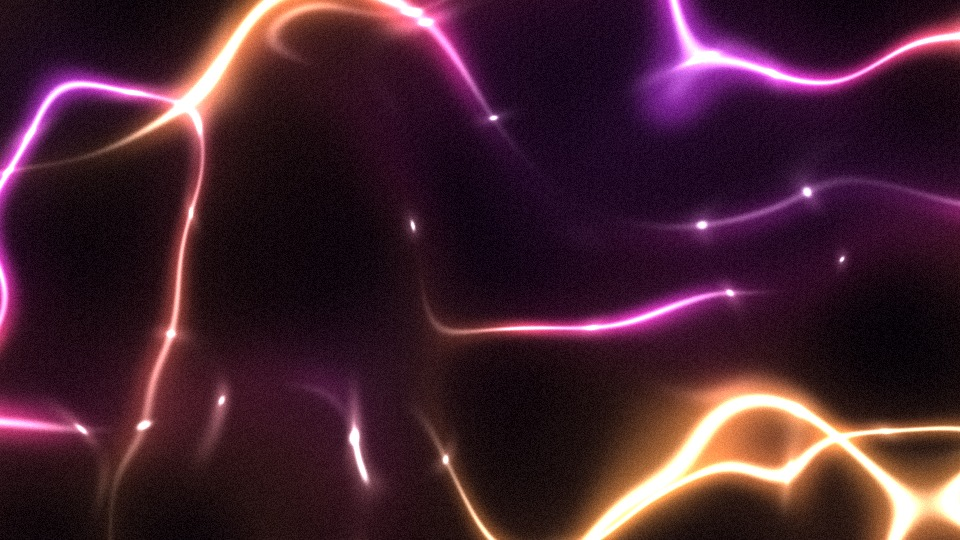<br /><b>Wisp</b> <code>wisp</code><br />Molten threads on dark, with hot beads and sparks.</td>
    <td>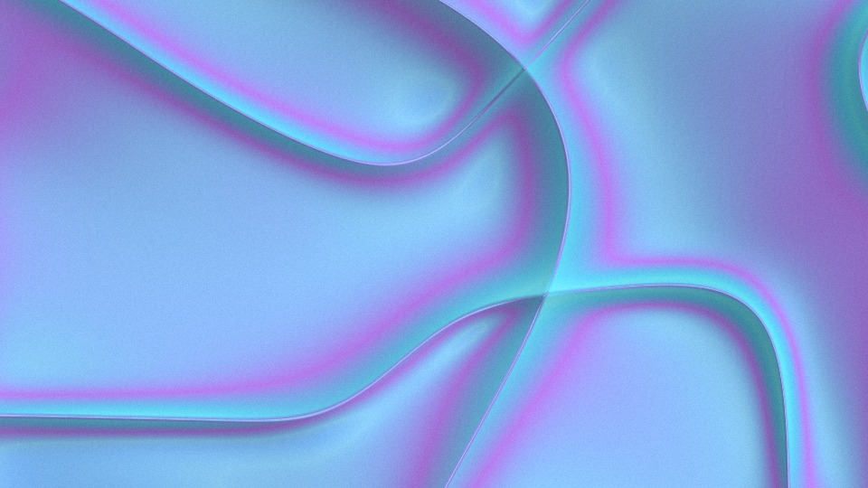<br /><b>Nacre</b> <code>nacre</code><br />Glassy liquid folds whose colour shifts on every slope.</td>
    <td>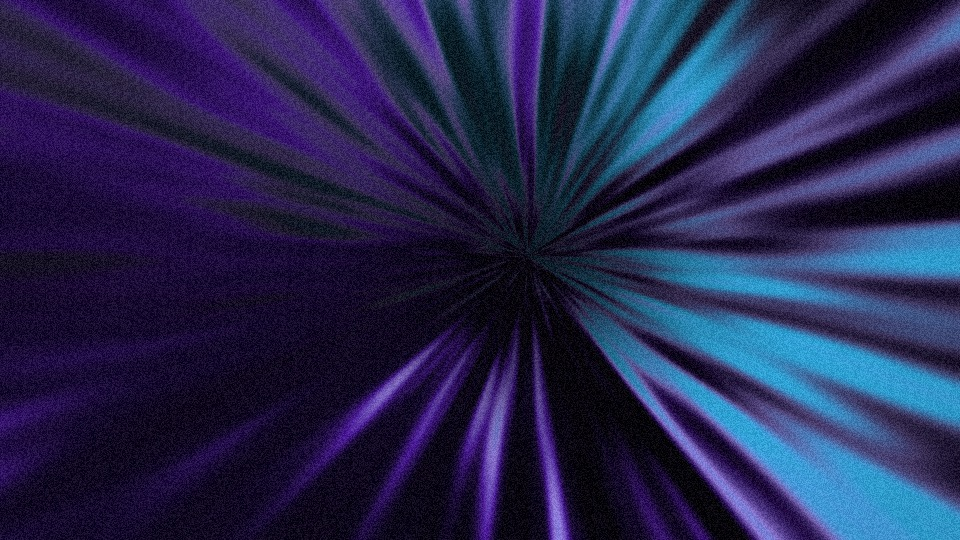<br /><b>Burst</b> <code>burst</code><br />Thin rays fanning out of a dark core.</td>
    <td>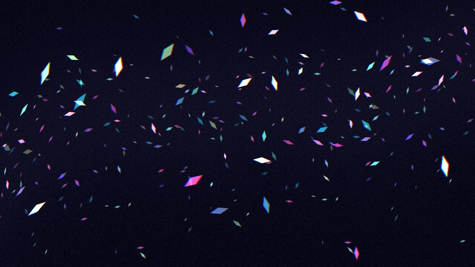<br /><b>Glint</b> <code>glint</code><br />A shoal of spinning shards streaming along a current.</td>
  </tr>
  <tr>
    <td colspan="4" align="center"><b>Your palette</b>: try every look with your own colours in the <a href="https://instantgradient.com/app">live editor</a>.</td>
  </tr>
</table>

Every shader is a named export (`flow`, `beam`, `bloom`, `halo`, `strata`, `dune`, `whorl`, `silk`, `wisp`, `nacre`, `burst`, `glint`) with a matching React component (`<Flow>`, `<Beam>`, `<Bloom>`, `<Halo>`, `<Strata>`, `<Dune>`, `<Whorl>`, `<Silk>`, `<Wisp>`, `<Nacre>`, `<Burst>`, `<Glint>`).

### Params

Pass any subset through `params`; whatever you leave out keeps its default. All shaders also take `grain` (0 – 0.3), a film-grain amount.

```tsx
<Halo colors={colors} params={{ radius: 1.3, y: -0.85, flares: 0.2 }} />
```

<details>
<summary><b>Flow</b></summary>

| Param | Range | Default | What it does |
| --- | --- | --- | --- |
| `scale` | 0.6 – 2.6 | 1.7 | Size of the colour masses |
| `curl` | 0.3 – 1.6 | 1.05 | How tight the eddies are |
| `drift` | 0 – 1 | 0.5 | How strongly the currents swirl |
| `openness` | 0 – 1 | 0.28 | Gives the first colour more calm, empty space |

</details>

<details>
<summary><b>Beam</b></summary>

| Param | Range | Default | What it does |
| --- | --- | --- | --- |
| `scale` | 0.5 – 2 | 1 | How much the beam bends |
| `width` | 0.04 – 0.6 | 0.14 | Beam thickness, from hairline to wall of light |
| `glow` | 0 – 1 | 0.5 | How far light spills into the dark |
| `angle` | 0 – 360 | 28 | Beam direction, in degrees |

</details>

<details>
<summary><b>Bloom</b></summary>

| Param | Range | Default | What it does |
| --- | --- | --- | --- |
| `scale` | 0.5 – 2 | 0.9 | Petal length |
| `petals` | 6 – 16 | 11 | Petals around the full circle (about half are in frame) |
| `pinch` | 0.35 – 2.5 | 0.6 | Low is fat petals with thin creases, high is a slim star |
| `bend` | -0.9 – 0.9 | 0.25 | Curves the petals one way or the other |
| `sway` | 0 – 1 | 0.5 | Motion of the shapes: petals breathe and lean |
| `colorflow` | 0 – 1 | 0 | Motion of the colours: they travel outward through still petals |

</details>

<details>
<summary><b>Halo</b></summary>

| Param | Range | Default | What it does |
| --- | --- | --- | --- |
| `radius` | 0.12 – 1.6 | 1 | Disc radius, in frame heights |
| `x`, `y` | -1 – 1 | 0, -0.78 | Disc position. `0` is centred; `±1` puts the disc just outside that edge, whatever the radius |
| `glow` | 0 – 1 | 0.5 | Reach of the corona |
| `crescent` | 0 – 1 | 0.35 | `0` is a full ring, `1` a single lit arc |
| `flares` | 0 – 1 | 0.5 | Streamer strength, from smooth glow to spiky corona |

The default is the horizon composition (big disc, mostly below the frame). For a centred eclipse use `{ radius: 0.3, y: 0 }`.

</details>

<details>
<summary><b>Strata</b></summary>

| Param | Range | Default | What it does |
| --- | --- | --- | --- |
| `scale` | 0.4 – 2.5 | 1 | Size of the landscape |
| `layers` | 3 – 16 | 7 | Number of paper sheets |
| `warp` | 0 – 1 | 0.5 | Round islands at `0`, liquid marbled shorelines at `1` |
| `ridges` | 0 – 1 | 0.25 | Turns islands into branching spines and crater rims |
| `stretch` | 0 – 1 | 0.2 | Draws shapes out into long flowing bands |
| `depth` | 0 – 1 | 0.6 | Shadow length and strength; `0` is flat |
| `blend` | 0 – 1 | 0.15 | `0` is one flat colour per sheet, `1` a continuous gradient |
| `angle` | 0 – 360 | 125 | Where the light comes from, in degrees |

</details>

<details>
<summary><b>Dune</b></summary>

| Param | Range | Default | What it does |
| --- | --- | --- | --- |
| `layers` | 2 – 12 | 6 | Number of crests |
| `swell` | 0 – 1.6 | 0.7 | Crest height; high values make crests cross each other |
| `waves` | 0.3 – 5 | 1.4 | Undulations across the frame |
| `fade` | 0 – 1.5 | 0.9 | How far each layer fades below its crest |
| `soft` | 0 – 1 | 0.02 | Crest edge, from vector-crisp to fog |
| `angle` | 0 – 360 | 352 | Rotation of the whole stack, in degrees |

</details>

<details>
<summary><b>Whorl</b></summary>

| Param | Range | Default | What it does |
| --- | --- | --- | --- |
| `blades` | 2 – 24 | 9 | Number of blades |
| `twist` | -3 – 3 | 1.1 | Spiral tightness; the sign picks the winding direction, `0` is a straight fan |
| `depth` | 0 – 1.5 | 0.8 | Strength of the crease at each blade edge |
| `scale` | 0.3 – 3 | 1.2 | Distance over which the palette runs, centre to rim |
| `wobble` | 0 – 1 | 0.4 | Organic bending; `0` is a perfect pinwheel |
| `x`, `y` | -1.5 – 1.5 | -0.55, -0.7 | Centre position. `0` is the middle, `±1` the frame edge, beyond is off-frame |

</details>

<details>
<summary><b>Silk</b></summary>

| Param | Range | Default | What it does |
| --- | --- | --- | --- |
| `scale` | 0.3 – 2.5 | 1 | Fold size |
| `folds` | 0 – 1 | 0.6 | `0` is rumpled cloth, `1` long parallel drapery |
| `depth` | 0.2 – 2 | 1 | Relief height; how steeply the folds shade |
| `warp` | 0 – 1 | 0.5 | Bends the folds so they gather and fork |
| `sheen` | 0 – 1 | 0.6 | Satin highlight strength |
| `light` | 0 – 360 | 20 | Light direction relative to the folds. `0` and `180` rake across them, `90` and `270` flatten the relief |

Silk's `grain` goes up to 0.5; at `sheen: 0` with heavy grain it is matte cloth.

</details>

<details>
<summary><b>Wisp</b></summary>

| Param | Range | Default | What it does |
| --- | --- | --- | --- |
| `scale` | 0.5 – 2.5 | 1.2 | How tightly the threads wander |
| `width` | 0.3 – 2 | 1 | Thread thickness, core and glow together |
| `glow` | 0 – 1 | 0.6 | Coloured glow around each thread |
| `sparks` | 0 – 1 | 0.6 | Hot beads along the threads and at crossings |

</details>

<details>
<summary><b>Nacre</b></summary>

| Param | Range | Default | What it does |
| --- | --- | --- | --- |
| `scale` | 0.4 – 2 | 0.9 | Lobe size |
| `flow` | 0 – 1 | 0.5 | Domain warp: `0` round pools, `1` pulled liquid |
| `crease` | 0 – 1 | 0.6 | Thin sharp fold lines between the lobes |
| `depth` | 0.2 – 2 | 1 | Relief height, and so how far the colour shifts on slopes |
| `iridescence` | 0 – 1 | 0.6 | How far along the ramp a slope walks. `0` is a plain lit gradient |
| `light` | 0 – 360 | 40 | Light direction, in degrees |

</details>

<details>
<summary><b>Burst</b></summary>

| Param | Range | Default | What it does |
| --- | --- | --- | --- |
| `rays` | 0 – 1 | 0.6 | Ray contrast: `0` soft sectors, `1` hard thin rays |
| `core` | 0.2 – 2 | 1 | Radius of the dark core |
| `x`, `y` | -1 – 1 | 0.1, 0.05 | Centre position; `0` is the middle, `±1` the frame edge |
| `spin` | 0 – 1 | 0.5 | Rotation rate. The ray field holds still on loops under 12 s and only streams outward |

</details>

<details>
<summary><b>Glint</b></summary>

| Param | Range | Default | What it does |
| --- | --- | --- | --- |
| `size` | 0.01 – 0.06 | 0.03 | Shard length, in frame heights |
| `density` | 0.2 – 1 | 0.6 | How many cells hold a shard |
| `bend` | 0 – 1 | 0.5 | How far the current arcs across the frame |
| `angle` | 0 – 360 | 10 | Direction of the current |
| `speed` | 0.3 – 2 | 1 | Streaming speed when not looping; a loop always travels one pattern period |

</details>

The same data is available at runtime: every shader def carries `params` (key, label, min, max, step, default), which is enough to build a settings panel, and `randomParams(rand)`, which returns a good-looking random set.

```ts
import { dune } from "instantshader";

handle.setParams(dune.randomParams(Math.random));
```

## Effects

An effect redraws a picture. The picture can be one of the shaders above or an image you supply, and the result still loops and exports like everything else.

<table>
  <tr>
    <td width="25%">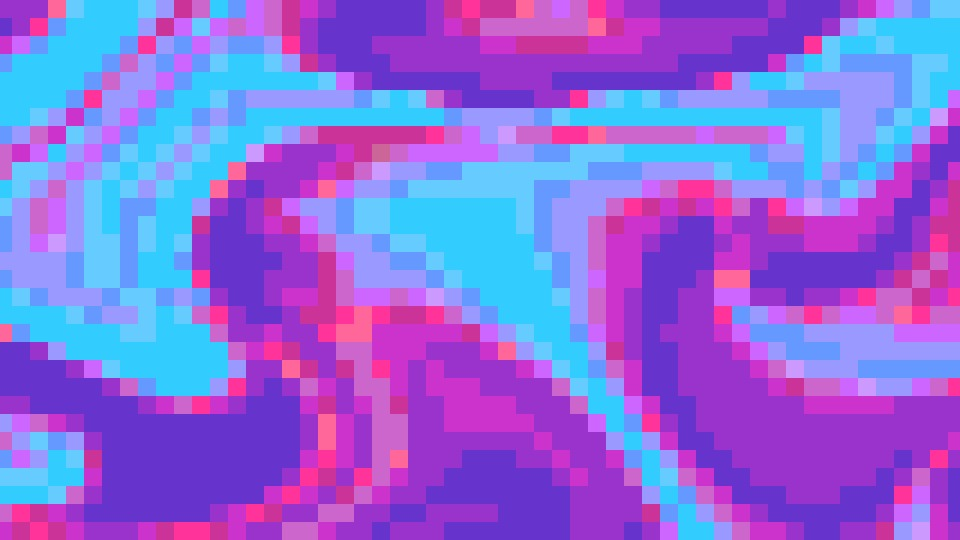<br /><b>Pixelate</b> <code>pixelate</code><br />Flat cells, with optional posterize and grid lines.</td>
    <td width="25%">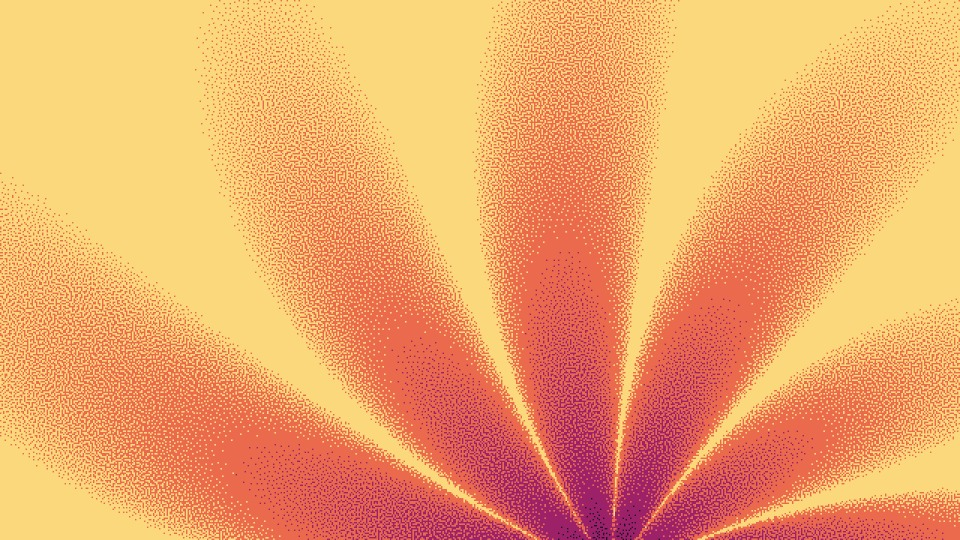<br /><b>Dither</b> <code>dither</code><br />Bayer or blue-noise patterns, two to eight levels.</td>
    <td width="25%">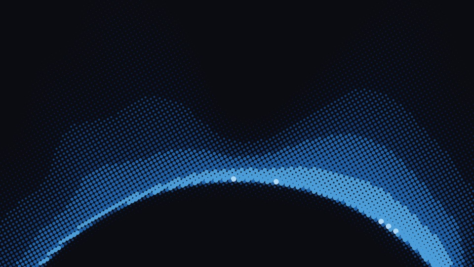<br /><b>Halftone</b> <code>halftone</code><br />Dots, lines or squares on a square or hex screen.</td>
    <td width="25%">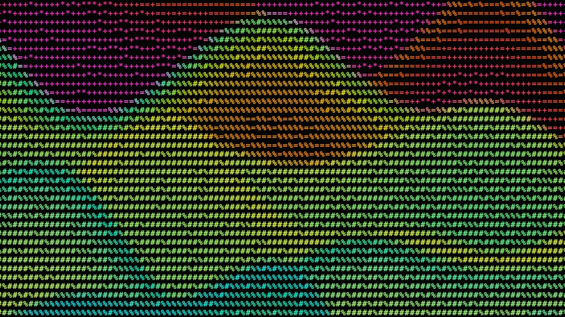<br /><b>ASCII</b> <code>ascii</code><br />Characters picked by brightness, six sets.</td>
  </tr>
</table>

Over a shader, in React:

```tsx
import { Bloom, dither } from "@instantshader/react";

<Bloom
  colors={["#140f30", "#9c2168", "#eb6a4e", "#fcd87c"]}
  loopSeconds={30}
  effects={[{ effect: dither, params: { pattern: "blueNoise", size: 4, colorMode: "palette", levels: 4 } }]}
  style={{ width: "100%", height: 480 }}
/>
```

Over your own image, in vanilla JS. Any ``, `<canvas>`, `<video>` or `ImageBitmap` works as `media`:

```ts
import { mountStack, halftone } from "instantshader";

const img = new Image();
img.src = "/photo.jpg";
await img.decode();

mountStack(el, {
  source: { kind: "media", media: img }, // fit: "cover" (default) or "contain"
  colors: ["#111111", "#f4f1ea"],
  effects: [{ effect: halftone, params: { size: 20, angle: 30 } }],
});
```

In React that is `<ShaderStack source={{ kind: "media", media: img }} colors={...} effects={...} />`. `effects` is a list, bottom layer first, so effects can stack.

### Effect params

Same rules as shader params: pass a subset, the rest keep their defaults. Sizes are in pixels at 1080p, so a `size` of 4 is 4px cells in a 1920x1080 export and 8px cells at 4K, with the same number of cells in both.

Dither, halftone and ASCII share the colour params. `colorMode` is `source` (keep the picture's colours), `duotone` (`ink` on `paper`) or `palette` (the palette's colours). `invert` flips the tone scale. Over a shader, palette mode keeps the gradient's own colour layout: dither outputs `levels` steps of the ramp (set `levels` to the number of colours to get exactly those), and halftone and ASCII colour each dot or glyph with the nearest palette stop, flat.

<details>
<summary><b>Pixelate</b></summary>

| Param | Range | Default | What it does |
| --- | --- | --- | --- |
| `size` | 2 – 160 | 24 | Cell size |
| `levels` | 0 – 16 | 0 | Colours per channel. 0 keeps full colour |
| `gap` | 0 – 0.4 | 0 | Grid lines, as a fraction of the cell |
| `gapColor` | colour | `#000000` | Colour of the grid lines |

</details>

<details>
<summary><b>Dither</b></summary>

| Param | Range | Default | What it does |
| --- | --- | --- | --- |
| `pattern` | `bayer2`, `bayer4`, `bayer8`, `blueNoise` | `bayer4` | Threshold pattern |
| `size` | 1 – 16 | 4 | Cell size |
| `levels` | 2 – 8 | 2 | Output levels per channel, or along the tone scale |
| `bias` | -0.5 – 0.5 | 0 | Shifts every tone before quantizing |
| `linear` | on/off | off | Threshold in linear light. Physically accurate, but dark gradients lose detail |
| `shimmer` | 0 – 12 | 0 | Pattern jumps per second. 0 is static |
| `colorMode`, `ink`, `paper`, `invert` | | `source` | See above |

Floyd-Steinberg and the other error-diffusion dithers are not included. They are sequential, so a fragment shader cannot run them. Blue noise is the pattern that looks closest.

</details>

<details>
<summary><b>Halftone</b></summary>

| Param | Range | Default | What it does |
| --- | --- | --- | --- |
| `grid` | `square`, `hex` | `square` | Screen layout |
| `shape` | `dot`, `line`, `square` | `dot` | What each cell draws |
| `size` | 6 – 160 | 10 | Screen pitch |
| `angle` | 0 – 180 | 45 | Screen angle, in degrees |
| `radius` | 0.2 – 1.5 | 1.4 | Shape size. Below about 1.2 the screen reads washed out; above 1, shapes merge in dark areas |
| `softness` | 0 – 1 | 0.1 | Blurs shape edges |
| `contrast` | 0 – 2 | 1.15 | Tone contrast before sizing the shapes |
| `pulse` | 0 – 1 | 0 | Shapes swell and shrink in a wave across the frame |
| `colorMode`, `ink`, `paper`, `invert` | | `palette` | See above. `paper` fills the gaps in every mode |

</details>

<details>
<summary><b>ASCII</b></summary>

| Param | Range | Default | What it does |
| --- | --- | --- | --- |
| `charset` | `standard`, `dense`, `blocks`, `minimal`, `binary`, `katakana` | `standard` | Character set |
| `size` | 8 – 96 | 24 | Character height |
| `smooth` | on/off | on | Dithers between neighbouring characters so gradients don't band |
| `cycle` | 0 – 12 | 0 | Character re-rolls per second. 0 is static |
| `cycleAmount` | 0 – 1 | 0.3 | How far a re-roll can move along the character ramp |
| `colorMode`, `ink`, `paper`, `invert` | | `source` | See above. `paper` is the background in every mode |

Characters come from the system monospace font unless you pass `fontFamily` to the mount. Load a custom font with `document.fonts.load` first.

</details>

### The export matches the preview

Effects compute one value per cell into a small buffer whose size depends only on the params and the aspect ratio, and every output size paints that same buffer. A 900px preview and a 3840x2160 export contain the same cells with the same values. 1080p and 4K exports (and their square and portrait equivalents) are pixel-exact. Other sizes, the preview included, are the export downscaled in linear light, so a dither too fine for a small preview to resolve still shows the right brightness. `getGridInfo()` on the handle reports output pixels per cell if you want to warn users about that case.

Video export works as before, with `createStackRenderer` in place of `createRenderer`:

```ts
const stack = createStackRenderer({ canvas, source, effects, colors, seed, loopSeconds: 30 });
for (let f = 0; f < frames; f++) {
  stack.renderAt((f / fps) * 1000); // then hand `canvas` to your encoder
}
```

Effect motion follows the same loop rules as the shaders, so a looping stack repeats exactly.

## API

### `mountGradient(container, options)`

| Option | Type | Default | |
| --- | --- | --- | --- |
| `shader` | `ShaderDef` | required | One of the shader exports |
| `colors` | `string[]` | required | 2 to 8 hex colours, in ramp order |
| `params` | `Record<string, number>` | shader defaults | See [Params](#params) |
| `speed` | `number` | `1` | Animation speed multiplier; `0` freezes it |
| `seed` | `number` | `0` | Picks the composition. Same seed, same picture |
| `loopSeconds` | `number` | off | See [Seamless loops](#seamless-loops) |

It returns a handle:

| Method | |
| --- | --- |
| `setColors(colors)` | Swap the palette without remounting |
| `setParams(params)` | Merge new params into the current ones |
| `setSpeed(speed)` | Change speed without a jump in the animation |
| `setLoopSeconds(seconds)` | Change or disable (`undefined`) the loop period |
| `pause()` / `resume()` | Pausing stops the render loop entirely, so a paused canvas costs nothing |
| `seek(ms)` / `getTimeMs()` | Jump to, or read, the playback position |
| `canvas` | The underlying `<canvas>` element |
| `dispose()` | Stop rendering and release the WebGL context |

### `mountStack(container, options)`

Like `mountGradient`, with a `source` (`{ kind: "generator", shader, params }` or `{ kind: "media", media, fit }`) in place of `shader`, plus `effects`, `background` (behind contain-fit media, default black) and `fontFamily`. The handle adds `setSource`, `setSourceParams`, `setEffects`, `setEffectParams(index, params)`, `refreshMedia()` (re-upload a video element's current frame) and `getGridInfo()`. `renderStackFrame` and `createStackRenderer` take the same options for one-shot and export use.

### React props

`<Flow>`, `<Beam>`, `<Bloom>`, `<Halo>`, `<Strata>`, `<Dune>`, `<Whorl>`, `<Silk>`, `<Wisp>`, `<Nacre>`, `<Burst>`, `<Glint>` take `colors`, `params`, `effects`, `speed`, `seed`, `loopSeconds`, `paused`, `className` and `style`. Changing `colors`, `params`, `effects`, `speed` or `paused` updates the live canvas; only a new `seed` remounts it. `<ShaderStack>` takes a `source` instead of being tied to one shader, which is how you put effects over an image.

To pick the shader dynamically, use the generic component:

```tsx
import { ShaderCanvas, flow } from "@instantshader/react";
import { getShader } from "instantshader";

<ShaderCanvas shader={getShader(id) ?? flow} colors={colors} />;
```

`getShader(id)` and the `shaders` array come from `instantshader`. Importing either pulls in every shader, so prefer the named exports when you know which look you want.

### Respecting reduced motion

The library does not read user preferences for you. One line covers it:

```tsx
const reduce = window.matchMedia("(prefers-reduced-motion: reduce)").matches;

<Dune colors={colors} paused={reduce} />;
```

## Seamless loops

Set `loopSeconds` and the animation repeats exactly: the frame at `t` and the frame at `t + loopSeconds` are identical pixel for pixel, with no visible seam at the wrap.

```ts
mountGradient(el, { shader: flow, colors, loopSeconds: 30 });
```

- 15 to 60 seconds is the comfortable range.
- The period is measured in animation seconds, so it interacts with `speed`: a 60s loop at `speed: 2` completes in 30 real seconds.
- A short loop makes some motions run faster, since they have to complete a whole cycle in less time. Prefer a longer loop with a higher `speed` over a very short loop.

Per-shader details are in the [`instantshader` package README](packages/core/README.md#seamless-loops).

## Exporting frames

`renderGradientFrame` draws one frame into a detached canvas at an exact pixel size, for thumbnails, social images or feeding a video encoder.

```ts
import { renderGradientFrame, strata } from "instantshader";

const { canvas, dispose } = renderGradientFrame({
  shader: strata,
  colors: ["#140f30", "#9c2168", "#eb6a4e", "#fcd87c"],
  seed: 3,
  timeMs: 2000,
  width: 1920,
  height: 1080,
});

const png = canvas.toDataURL("image/png");
dispose(); // releases the WebGL context
```

For video, use `createRenderer({ canvas, shader, colors, params, seed, loopSeconds })` and call `renderAt(timeMs)` once per frame on the same canvas. The images in this README were rendered this way.

## Browser support

Anything with WebGL1, which is every current browser. If a context cannot be created, `mountGradient` throws, so wrap it in a `try` if you need a CSS fallback.

## Packages

| Package | |
| --- | --- |
| [`instantshader`](packages/core) | Core engine and shaders. Zero dependencies |
| [`@instantshader/react`](packages/react) | React components |
| `playground` | Local playground with live controls (not published) |

## Development

```bash
pnpm i
pnpm exec playwright install chromium # first time only, for the browser tests
pnpm build
pnpm test
pnpm playground
```

The playground reads the built package, so run `pnpm build` after changing a shader.

<details>
<summary><b>Releasing</b> (maintainers)</summary>

<br />

Every user-visible change needs a changeset:

```bash
pnpm changeset
```

Once `.github/workflows/release.yml` is active, merging to `main` opens a
version PR; merging that PR publishes both packages from CI via npm trusted
publishing (OIDC — no npm token is stored anywhere).

Both packages were bootstrapped by hand at 0.1.0 (npm cannot create a package
through trusted publishing), so that step is done. What remains to hand
releases over to CI:

1. For each package on npmjs.com: **Settings → Trusted Publisher → GitHub
   Actions**, owner `ugolbck`, repo `instantshader`, workflow filename
   `release.yml`, and tick the **`npm publish`** allowed action.
2. Set the repository variable `RELEASE_ENABLED=true` (Settings → Secrets and
   variables → Actions → Variables).

**Publishing by hand** is still the fallback until the above is wired up:

```bash
pnpm changeset version   # applies pending changesets, writes CHANGELOGs
pnpm build
cd packages/core  && pnpm publish
cd ../react       && pnpm publish
```

Use **`pnpm publish`, never `npm publish`**: only pnpm rewrites
`@instantshader/react`'s `"instantshader": "workspace:*"` into a real version
range. `npm publish` ships the literal `workspace:*` and the package is
uninstallable. Both set `publishConfig.access: public`, so no `--access` flag
is needed.

Expect a few minutes between a successful publish and the version becoming
installable — npm scans every publish for malware before releasing it.

</details>

## License

[MIT](LICENSE). Built by [InstantGradient](https://instantgradient.com).
